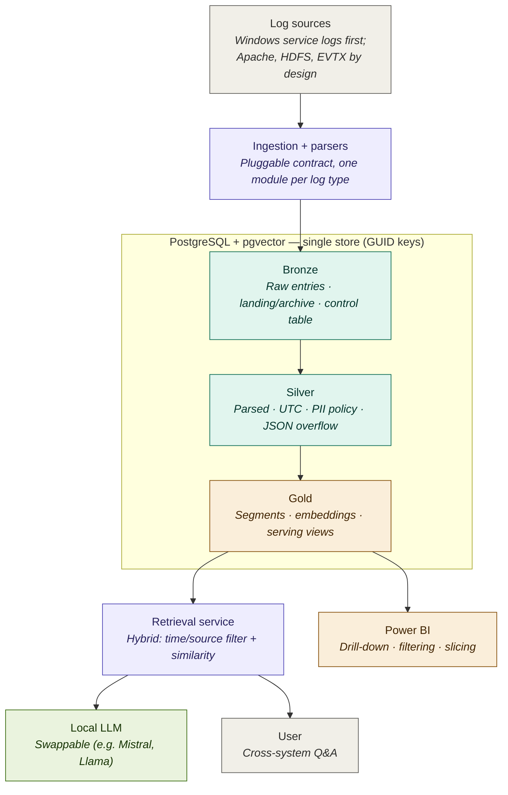
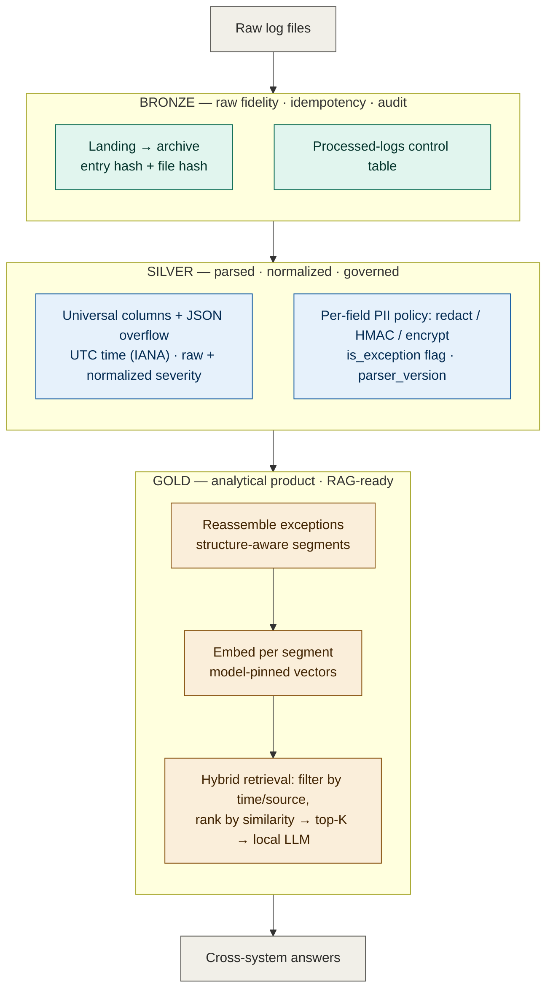

# Architecture

This document gives the high-level architecture of LogLens. It complements the [Architecture Decision Records](adr/adrs.md), which capture *why* each decision was made; this page shows *what* the system is and *how* data moves through it.

The diagrams below are written in [Mermaid](https://mermaid.js.org/) and render natively on GitHub.

---

## 1. Container view (C4 level 2)

A container-level view of LogLens: what the major pieces are and how they talk to each other. Log sources feed a pluggable ingestion and parsing layer, which writes into a single PostgreSQL + pgvector store organized as bronze, silver, and gold. A retrieval service combines time/source filtering with vector similarity, calls a local LLM, and answers user questions. Power BI reads the gold layer directly for drill-down and slicing.

**How to read it.** The store is one database, not three — the Medallion layers are logical, sharing PostgreSQL + pgvector ([ADR-013](adr/adrs.md)). The chat LLM hangs off the retrieval service as a swappable component, while the embedding model (used during ingestion into gold) is a pinned, versioned dependency ([ADR-012](adr/adrs.md)). Power BI is a consumer of gold, not part of the core pipeline.

---

## 2. Medallion data flow

The journey of a log entry through the layers, and where each transformation happens. Raw entries land in bronze with hashing for idempotency and a control table for traceability. They are parsed and normalized into silver. In gold, exceptions are reassembled and split into structure-aware segments, each segment is embedded, and hybrid retrieval serves cross-system questions.

**How to read it.** Each layer is independently re-runnable, and the boundaries between them are where idempotency and lineage are enforced. The single most important design point is in gold: exceptions are *reassembled* from multi-line entries, then split into segments that become the unit of embedding ([ADR-009](adr/adrs.md), [ADR-010](adr/adrs.md)). Retrieval is deliberately **hybrid** — time and source filtering combined with vector similarity — because the headline use case ("what happened in other systems around that time") is a temporal join, which pure vector similarity cannot answer on its own ([ADR-011](adr/adrs.md), [ADR-013](adr/adrs.md)).

---

## Where to go next

- The reasoning behind every decision above: **[Architecture Decision Records](adr/adrs.md)**
- Project overview and status: **[README](../README.md)**
